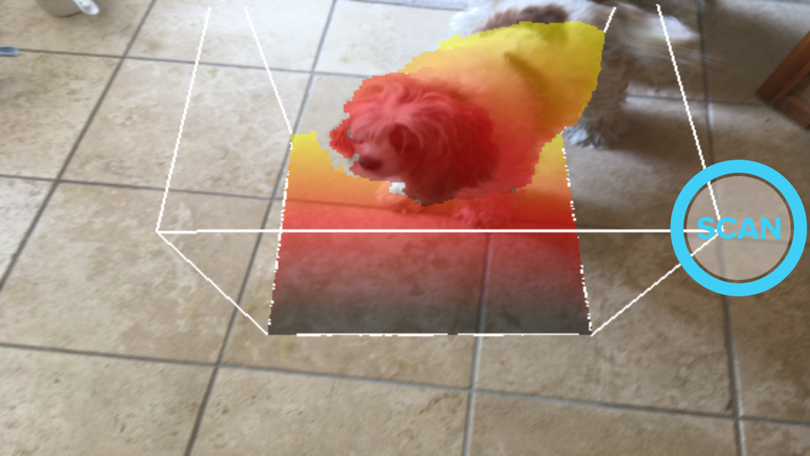
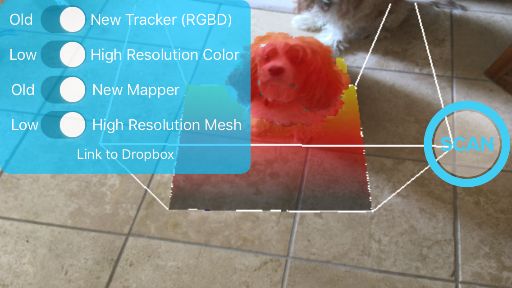
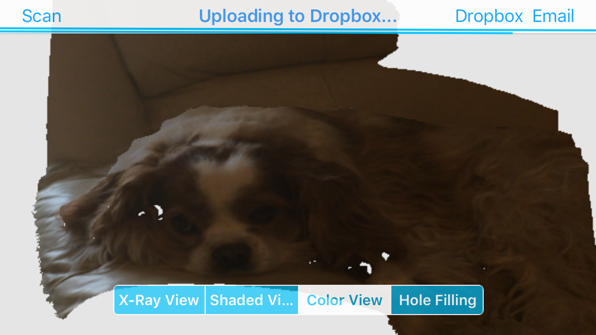
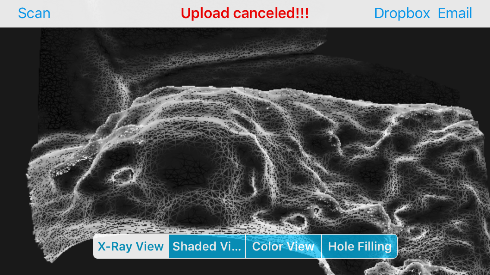
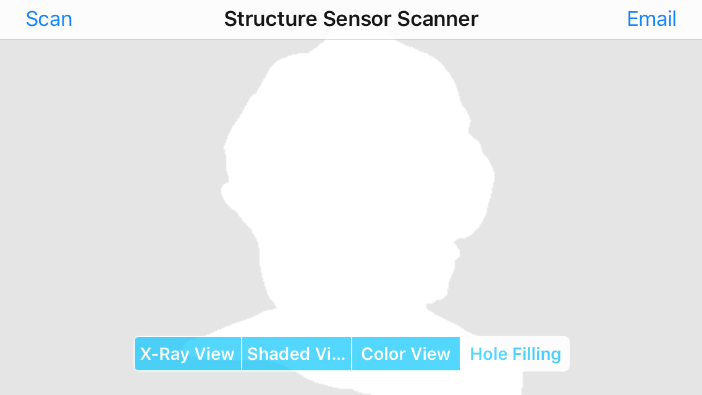

# StructureCloudScanner
Swift 3 port of Structure Scanner sample app with Dropbox support for cloud storage

*The Structure.framework, which is part of the StructureSDK, is not included. The Structure.framework needs to be copied into the "Scanner" directory*

### Summary

This version builds on Xcode 8 and uses Swift v3. You will need a [Structure Sensor](http://structure.io) and the StructureSDK.

  

 
### Contents

The controls of hidden by default and require a long press to make them visible. The view port has also been set to the size of the screen. 

When uploading to dropbox, the preview picture is a snapshot of what is currently displayed, unlike the email version which is rendered from the initial viewpoint

  

The controls have a button to link the app to your Dropbox account. You will not be able to upload any files until you have linked the app with your account. Once linked, the button text changes and it can unlink the app from your account.

  

I have included the App key to the SensorUploader dropbox app which will create the directory SensorUploads in the Apps directory for convenience, you can create and use you own dropbox app if you prefer.

When uploading to dropbox, two progress bars (one for the preview file and one for the model.zip file), are displayed in the navigation bar. The title text is also changed to reflect any current operations.

  

You can cancel an upload by tapping on the navigation bar. The title will change to "Upload canceled!!!" if the upload has been canceled.

  

## Work in Progress
A control to run the Hole Filling task has been added to the UISegmentedControl. Currently holes in the mesh are being filled, but the texture information is being lost.

The result is a ghost like rendering in the color view, but fine in the x-ray and shaded view.

  

## Contact

Christopher Worley - [n6xej@yahoo.com](mailto:n6xej@yahoo.com)
 
## License

MIT License

Copyright (c) 2016 Christopher Worley

Permission is hereby granted, free of charge, to any person obtaining a copy
of this software and associated documentation files (the "Software"), to deal
in the Software without restriction, including without limitation the rights
to use, copy, modify, merge, publish, distribute, sublicense, and/or sell
copies of the Software, and to permit persons to whom the Software is
furnished to do so, subject to the following conditions:

The above copyright notice and this permission notice shall be included in all
copies or substantial portions of the Software.

THE SOFTWARE IS PROVIDED "AS IS", WITHOUT WARRANTY OF ANY KIND, EXPRESS OR
IMPLIED, INCLUDING BUT NOT LIMITED TO THE WARRANTIES OF MERCHANTABILITY,
FITNESS FOR A PARTICULAR PURPOSE AND NONINFRINGEMENT. IN NO EVENT SHALL THE
AUTHORS OR COPYRIGHT HOLDERS BE LIABLE FOR ANY CLAIM, DAMAGES OR OTHER
LIABILITY, WHETHER IN AN ACTION OF CONTRACT, TORT OR OTHERWISE, ARISING FROM,
OUT OF OR IN CONNECTION WITH THE SOFTWARE OR THE USE OR OTHER DEALINGS IN THE
SOFTWARE.
